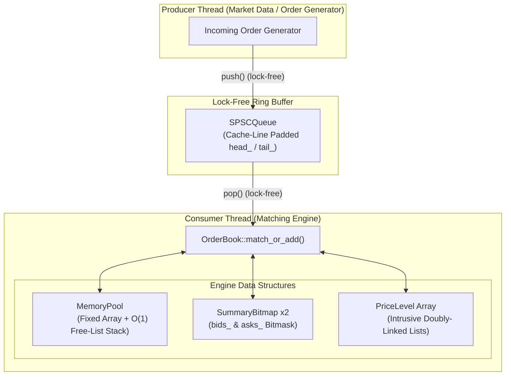

# ⚡ Low-Latency Multi-Threaded HFT Order Book Engine


A high-frequency trading (HFT) limit order book engine written in **C++20**, engineered for ultra-low latency (<60 ns mean execution), zero dynamic memory allocations on the hot path, $O(1)$ price-time-priority matching using 2-level summary bitmaps, and lock-free SPSC inter-thread message passing.

This engine demonstrates the real hardware- and systems-level engineering techniques employed by tier-1 market makers and exchange matching engines, avoiding high-overhead standard library abstractions in favor of cache-aligned intrusive data structures and bit-manipulation hardware intrinsics.

---

## 📌 Table of Contents

- [Architectural Highlights](#-architectural-highlights)
- [System Architecture](#-system-architecture)
- [Deep Dive: Core Components & Data Structures](#-deep-dive-core-components--data-structures)
  - [1. Order Struct Layout & Memory Locality](#1-order-struct-layout--memory-locality)
  - [2. SummaryBitmap — True O(1) Best Price Discovery](#2-summarybitmap--true-o1-best-price-discovery)
  - [3. MemoryPool — Zero Allocation Hot Path](#3-memorypool--zero-allocation-hot-path)
  - [4. SPSCQueue — Lock-Free Inter-Thread Messaging](#4-spscqueue--lock-free-inter-thread-messaging)
  - [5. Generation-Counted Order Handles (ABA Mitigation)](#5-generation-counted-order-handles-aba-mitigation)
  - [6. Exchange-Accurate Amend Semantics](#6-exchange-accurate-amend-semantics)
- [Measured Performance & Benchmarks](#-measured-performance--benchmarks)
  - [End-to-End Pipeline Latency](#end-to-end-pipeline-latency)
  - [Engine Comparison vs. Naive Baseline](#engine-comparison-vs-naive-baseline)
  - [Benchmarking Environment](#benchmarking-environment)
- [Build, Test & Run Guide](#-build-test--run-guide)
  - [Prerequisites](#prerequisites)
  - [Using CMake](#using-cmake)
  - [Direct Compilation (GCC / Clang)](#direct-compilation-gcc--clang)
- [Low-Latency Systems Design Notes](#-low-latency-systems-design-notes)
  - [Single-Threaded Core Engine & Symbol Sharding](#single-threaded-core-engine--symbol-sharding)
  - [Deterministic Replay & Durability](#deterministic-replay--durability)
- [Repository File Map](#-repository-file-map)

---

## 🚀 Architectural Highlights

| Feature | Standard Naive Engine (`std::map` + `std::list`) | This HFT Engine | Impact / Benefit |
| :--- | :--- | :--- | :--- |
| **Price Discovery** | $O(\log N)$ Tree search + pointer chasing | **$O(1)$ 2-Level Summary Bitmap** (`tzcnt`/`lzcnt`) | Constant-time best bid/ask lookup ($<3$ CPU instructions) |
| **Memory Allocation** | Dynamic `new`/`delete` per order / cancel | **Zero Heap Allocations on Hot Path** | Eliminates allocator lock contention & OS page faults |
| **Memory Layout** | Node objects scattered across heap | **Contiguous `alignas(64)` Slab Memory** | 100% cache-line utilization, zero false sharing |
| **Node Links** | 64-bit pointers (8 bytes per link) | **32-bit Pool Index Offsets** | Reduces struct size, fits full node into single 64B line |
| **Thread Inter-Process** | Mutexes + Condition Variables | **Lock-Free SPSC Ring Buffer** (`acquire`/`release`) | Sub-10ns message passing without thread context switches |
| **Order Handles** | Raw pointers / bare array indices | **Generation-Encoded Handles** (`generation << 32 \| slot`) | $O(1)$ stale handle detection & safe slot reuse (ABA protection) |
| **Amend Semantics** | In-place field overwrite (incorrect) | **Real Exchange Rules** (In-place qty drop vs. Cancel-Replace) | Preserves FIFO queue priority accurately |

---

## 📐 System Architecture

The pipeline decouples market data feed ingest / order generation from order book execution using a single-producer single-consumer lock-free ring buffer:



---

## 🔬 Deep Dive: Core Components & Data Structures

### 1. Order Struct Layout & Memory Locality

Every resting order is represented by the [`Order`](file:///c:/dev/Order_book_Project/include/OrderBook.hpp#L101) struct, explicitly padded and aligned to **64 bytes** (exactly one CPU cache line).

```cpp
struct alignas(64) Order {
    OrderId       order_id   = 0;           // generation<<32 | slot index
    Price         price      = 0;           // Integer price ticks (std::uint32_t)
    Quantity      quantity   = 0;           // Unfilled remaining quantity
    std::uint32_t prev       = kNullIndex;  // Intrusive pool index offset
    std::uint32_t next       = kNullIndex;  // Intrusive pool index offset
    Side          side       = Side::Buy;   // Buy or Sell
    bool          active     = false;       // Slot status flag
    std::array<std::byte, 39> _pad{};       // Explicit padding to 64 bytes
};
static_assert(sizeof(Order) == 64, "Order must occupy exactly one cache line");
```

- **Intrusive Index Offsets**: Instead of 8-byte raw pointers (`Order*`), `prev` and `next` store 32-bit indices into the [`MemoryPool`](file:///c:/dev/Order_book_Project/include/MemoryPool.hpp). This reduces node pointer overhead by 50% and allows the memory pool to remain a contiguous array.
- **Cache Line Alignment**: `alignas(64)` guarantees no `Order` struct straddles a cache line boundary, eliminating extra cache fetches during linked-list traversal.

---

### 2. SummaryBitmap — True O(1) Best Price Discovery

Finding the best bid (highest price) or best ask (lowest price) in a sparse book with 4,096 price ticks usually requires scanning or maintaining a search tree ($O(\log N)$).

[`SummaryBitmap`](file:///c:/dev/Order_book_Project/include/OrderBook.hpp#L45) achieves **$O(1)$ discovery** using a 2-level bitmask scheme:

- **Level 0 (`bits_`)**: 64 words of `uint64_t` (covering 4,096 price levels). Bit $i$ is set if price tick $i$ has active resting orders.
- **Level 1 (`summary_`)**: A single `uint64_t` summary word. Bit $k$ is set if Level-0 word $k$ is non-zero.

```
Level 1 (summary_):   [ 0 | 0 | 1 | 0 | ... | 0 ]  (Bit 2 set -> Level-0 word 2 has orders)
                                │
                                ▼
Level 0 (bits_[2]):   [ 0 | ... | 1 | 0 | 0 ]      (Bit 5 set -> Price tick 2*64 + 5 = 133 is active)
```

**Hardware Bit-Scan Operations**:
- `find_lowest()` uses `std::countr_zero` (compiles directly to CPU `tzcnt` instruction).
- `find_highest()` uses `std::countl_zero` (compiles directly to CPU `lzcnt` instruction).

Both operations execute in **2 memory loads and 2 CPU instructions**, completely invariant to book depth or sparsity.

---

### 3. MemoryPool — Zero Allocation Hot Path

The [`MemoryPool`](file:///c:/dev/Order_book_Project/include/MemoryPool.hpp) pre-allocates a fixed array of `Capacity` elements alongside a free-list index stack.

- `acquire()`: Pops an available slot index from the free-list in $O(1)$ time.
- `release()`: Pushes a slot index back onto the free-list in $O(1)$ time.

By sizing the pool at startup, zero `malloc`/`new` calls occur while matching orders, preventing heap allocator contention, OS page faults, and tail-latency spikes.

---

### 4. SPSCQueue — Lock-Free Inter-Thread Messaging

Inter-thread order submission is handled by [`SPSCQueue`](file:///c:/dev/Order_book_Project/include/SPSCQueue.hpp), a single-producer single-consumer lock-free ring buffer inspired by Vyukov's ring buffer pattern.

- **False Sharing Prevention**: `head_` (consumer) and `tail_` (producer) are isolated on dedicated cache lines using `alignas(hardware_destructive_interference_size)`.
- **Memory Ordering**: Uses strict `std::memory_order_acquire` and `std::memory_order_release` semantics without mutexes or heavy sequential consistency (`seq_cst`) CAS barriers.

---

### 5. Generation-Counted Order Handles (ABA Mitigation)

When orders are canceled or filled, their memory pool slots are recycled instantly. To prevent a client holding a stale order handle from modifying a newly allocated order in the same slot (the classic ABA problem), [`OrderHandle`](file:///c:/dev/Order_book_Project/include/Types.hpp#L47) encodes a **generation counter**:

$$\text{OrderId} = (\text{generation} \ll 32) \mid \text{slot\_index}$$

Whenever a pool slot is released, its internal generation counter increments. Stale handle access is detected in $O(1)$ time and safely rejected.

---

### 6. Exchange-Accurate Amend Semantics

In accordance with real-world financial venue matching rules (e.g., CME, Nasdaq):

1. **Quantity Reduction**: Amending an order to a lower quantity mutates the order in-place, preserving its time-priority position in the queue.
2. **Quantity Increase / Price Modification**: Treated as a **Cancel-Replace** (the order is unlinked and re-inserted at the tail of the new price level), forfeiting time priority.

---

## 📊 Measured Performance & Benchmarks

All performance measurements were executed on an **AWS EC2 `c7i-flex.large`** instance (Intel Sapphire Rapids, 2 dedicated vCPUs, Ubuntu 24.04, `g++ 13.3.0`, `-O3 -std=c++20`). Producer and consumer threads were pinned to separate physical cores via `pthread_setaffinity_np`.

### End-to-End Pipeline Latency

Timed across **100,000 randomized crossing orders** flowing through the SPSC ring buffer into the matching engine ([`orderbook_bench`](file:///c:/dev/Order_book_Project/src/main.cpp)):

| Metric | Value |
| :--- | :--- |
| **Throughput** | **10.73 Million orders/sec** |
| **Mean Latency** | **57.2 ns** |
| **p50 (Median)** | **53.0 ns** |
| **p90** | **82.0 ns** |
| **p99** | **127.0 ns** |
| **p99.9** | **183.0 ns** |
| **Max Latency** | **15.3 µs** |

---

### Engine Comparison vs. Naive Baseline

A single-threaded head-to-head comparison ([`compare_bench`](file:///c:/dev/Order_book_Project/benchmarks/compare_main.cpp)) was executed using the exact same order sequence against a naive reference engine ([`NaiveOrderBook`](file:///c:/dev/Order_book_Project/benchmarks/NaiveOrderBook.hpp) utilizing `std::map<Price, std::list<Order>>` + `std::unordered_map` lookup):

| Metric | This HFT Engine | Naive Engine (`std::map` + `std::list`) | Performance Gain |
| :--- | :--- | :--- | :--- |
| **Throughput** | **11.94M ops/sec** | 5.89M ops/sec | **2.0x faster** |
| **Mean Latency** | **54.1 ns** | 137.8 ns | **2.5x faster** |
| **p50 Latency** | **50.0 ns** | 124.0 ns | **2.5x faster** |
| **p90 Latency** | **77.0 ns** | 196.0 ns | **2.5x faster** |
| **p99 Latency** | **122.0 ns** | 360.0 ns | **3.0x faster** |
| **Max Latency** | **17.6 µs** | 165.6 µs | **9.4x reduction** |

```
LATENCY PERCENTILE COMPARISON (Nanoseconds - Lower is better)
─────────────────────────────────────────────────────────────────────────────
p50  │ Optimized:  50 ns  █████
     │ Naive:     124 ns  █████████████
──────┼──────────────────────────────────────────────────────────────────────
p90  │ Optimized:  77 ns  ████████
     │ Naive:     196 ns  ████████████████████
──────┼──────────────────────────────────────────────────────────────────────
p99  │ Optimized: 122 ns  ████████████
     │ Naive:     360 ns  ████████████████████████████████████████
```

---

### Benchmarking Environment

- **CPU**: Intel Xeon Scalable (Sapphire Rapids) @ 3.2 GHz
- **OS**: Ubuntu 24.04 LTS (Kernel 6.8.0)
- **Compiler**: GCC 13.3.0 (`-O3 -std=c++20 -DNDEBUG`)
- **Isolation**: Threads pinned to core 0 & core 1 via `pin_to_core()`

---

## 🛠️ Build, Test & Run Guide

### Prerequisites

- C++20 compliant compiler: `g++` (>= 11.0), `clang++` (>= 13.0), or MSVC (2019+)
- `CMake` (>= 3.16)

---

### Using CMake

1. **Clone the repository**:
   ```bash
   git clone https://github.com/RavalDhruv21/Multi-Threaded-Order-Book-Engine.git
   cd Multi-Threaded-Order-Book-Engine
   ```

2. **Configure and build in Release mode**:
   ```bash
   cmake -B build -DCMAKE_BUILD_TYPE=Release
   cmake --build build -j
   ```

3. **Run Unit Tests**:
   ```bash
   ./build/orderbook_tests
   ```

4. **Run End-to-End Benchmark**:
   ```bash
   ./build/orderbook_bench
   ```

5. **Run Head-to-Head Comparison Benchmark**:
   ```bash
   ./build/compare_bench optimized
   ./build/compare_bench naive
   ```

---

### Direct Compilation (GCC / Clang)

```bash
# Build & run end-to-end multi-threaded benchmark
g++ -O3 -std=c++20 -pthread -Iinclude src/main.cpp -o orderbook_bench
./orderbook_bench

# Build & run functional test suite
g++ -O2 -std=c++20 -pthread -Iinclude tests/test_orderbook.cpp -o orderbook_tests
./orderbook_tests

# Build & run head-to-head performance comparison
g++ -O3 -std=c++20 -pthread -Iinclude benchmarks/compare_main.cpp -o compare_bench
./compare_bench optimized
./compare_bench naive
```

---

## 💡 Low-Latency Systems Design Notes

### Single-Threaded Core Engine & Symbol Sharding

A common pitfall in naive HFT designs is trying to multi-thread a single order book instance with fine-grained locks or CAS atomics. Real-world exchange matching engines avoid concurrent mutation of a single book because:

1. Price-time priority is by definition a **total sequence ordering problem**. Synchronizing multiple writer threads onto one book introduces lock contention or CAS retry loops that destroy latency.
2. The optimal scaling pattern is **Symbol Sharding**: assign 1 dedicated thread and 1 independent [`OrderBook`](file:///c:/dev/Order_book_Project/include/OrderBook.hpp#L129) instance per financial symbol (e.g., AAPL on Core 1, MSFT on Core 2). Throughput scales linearly across CPU cores with zero cross-thread synchronization overhead.

---

### Deterministic Replay & Durability

To ensure durability without sacrificing execution speed:

- Incoming orders are serialized to an append-only Write-Ahead Log (WAL) or ring-replicated feed (e.g., via kernel bypass / AXI bridge) **prior** to entering the engine thread.
- Because [`OrderBook`](file:///c:/dev/Order_book_Project/include/OrderBook.hpp#L129) is completely deterministic and single-threaded, system recovery simply requires replaying the event stream against a freshly initialized state.

---

## 📁 Repository File Map

```
Order_book_Project/
├── include/
│   ├── Types.hpp            # Domain types, OrderHandle bit-packing, IncomingOrder & ExecReport
│   ├── MemoryPool.hpp       # Fixed-capacity slab allocator with O(1) stack free-list
│   ├── SPSCQueue.hpp        # Lock-free single-producer single-consumer ring buffer
│   └── OrderBook.hpp        # Core engine, SummaryBitmap, Order layout & PriceLevel lists
├── src/
│   └── main.cpp             # End-to-end multi-threaded benchmark harness with core pinning
├── tests/
│   └── test_orderbook.cpp   # Comprehensive unit tests (matching, cancels, amends, ABA check)
├── benchmarks/
│   ├── NaiveOrderBook.hpp   # Baseline engine implementation (std::map + std::list)
│   └── compare_main.cpp     # Head-to-head single-threaded benchmark comparison
├── CMakeLists.txt           # Build configuration file
└── README.md                # Project documentation
```

Key file references:
- Core Engine Logic: [`include/OrderBook.hpp`](file:///c:/dev/Order_book_Project/include/OrderBook.hpp)
- Type Definitions & Handles: [`include/Types.hpp`](file:///c:/dev/Order_book_Project/include/Types.hpp)
- Slab Memory Allocator: [`include/MemoryPool.hpp`](file:///c:/dev/Order_book_Project/include/MemoryPool.hpp)
- Lock-Free IPC Ring Buffer: [`include/SPSCQueue.hpp`](file:///c:/dev/Order_book_Project/include/SPSCQueue.hpp)
- End-to-End Benchmark: [`src/main.cpp`](file:///c:/dev/Order_book_Project/src/main.cpp)
- Unit Tests: [`tests/test_orderbook.cpp`](file:///c:/dev/Order_book_Project/tests/test_orderbook.cpp)
- Comparison Benchmark: [`benchmarks/compare_main.cpp`](file:///c:/dev/Order_book_Project/benchmarks/compare_main.cpp)

---

## 📜 License

This project is licensed under the [MIT License](LICENSE).
